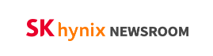
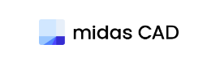
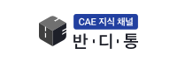
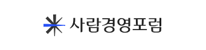

프로젝트를 연도별로 정리하였습니다. 
상세 페이지를 클릭하여 확인하세요.

<small>🚫 소규모 프로젝트 및 유지보수는 제외되었습니다.</small>

#### PROJECT

    <h2>2021</h2>
    

        

            <a href="/portfolio/sk-hynix-newsroom/" target="_blank">
                <h3>SK_HYNIX NEWSROOM</h3>
                
                

                    [HubSpot_CMS]
                

                

                    
2021.12

                

            </a>
        

    

    <a href="#page-title" class="back-to-top">{{ site.data.ui-text[site.locale].back_to_top | default: 'Back to Top' }} &uarr;</a>
    <h2>2022</h2>
    

        

            <a href="/portfolio/genesislab-viewinter/" target="_blank">
                <h3>GENESISLAB VIEWINTER</h3>
                
                

                    [HubSpot_CMS]
                

                

                    
2022.05

                

            </a>
        

        

            <a href="/portfolio/midas-cad/" target="_blank">
                <h3>MIDAS CAD</h3>
                
                

                    [HubSpot_CMS]
                

                

                    
2022.08

                

            </a>
        

        

            <a href="/portfolio/midas-banditong/" target="_blank">
                <h3>MIDAS BANDITONG</h3>
                
                

                    [HubSpot_CMS]
                

                

                    
2022.12

                

            </a>
        

    

    <a href="#page-title" class="back-to-top">{{ site.data.ui-text[site.locale].back_to_top | default: 'Back to Top' }} &uarr;</a>
    <h2>2023</h2>
    

        

            <a href="/portfolio/yujinrobot/" target="_blank">
                <h3>YUJIN ROBOT</h3>
                
                

                    [HubSpot_CMS]
                

                

                    
2023.06

                

            </a>
        

        

            <a href="/portfolio/swagelok/" target="_blank">
                <h3>SWAGELOK</h3>
                
                

                    [HubSpot_CMS]
                

                

                    
2023.10

                

            </a>
        

        

            <a href="/portfolio/lensly/" target="_blank">
                <h3>BAUSCHLOMB LENSLY</h3>
                
                

                    [React/Next.JS]
                

                

                    
2023.12

                

            </a>
        

    

    <a href="#page-title" class="back-to-top">{{ site.data.ui-text[site.locale].back_to_top | default: 'Back to Top' }} &uarr;</a>
    <h2>2024</h2>
    

        

            <a href="/portfolio/midas-jainlab/" target="_blank">
                <h3>MIDAS JAINLAB</h3>
                
                

                    [HubSpot_CMS]
                

                

                    
2024.03

                

            </a>
        

        

            <a href="/portfolio/" target="_blank">
                <h3>BAUSCHLOMB ADMIN</h3>
                
                

                    [React/Next.JS]
                

                

                    
2022.04

                

            </a>
        

    

    <a href="#page-title" class="back-to-top">{{ site.data.ui-text[site.locale].back_to_top | default: 'Back to Top' }} &uarr;</a>

